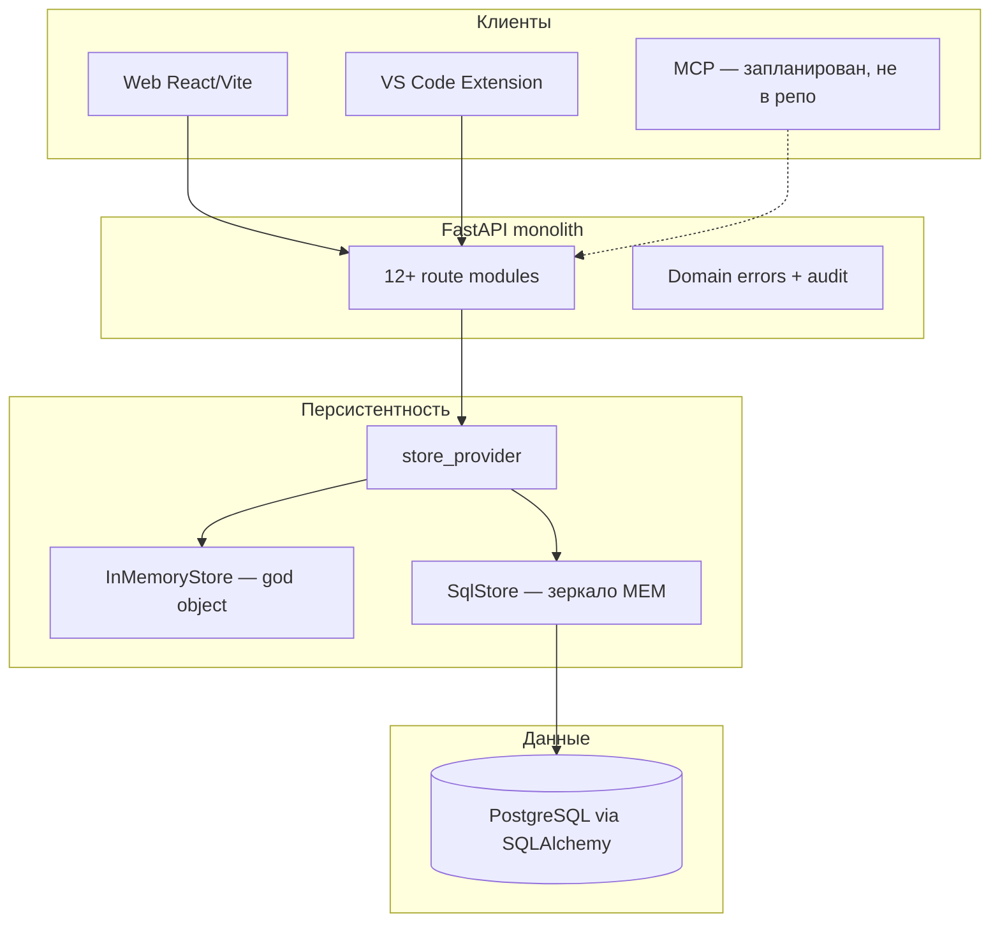
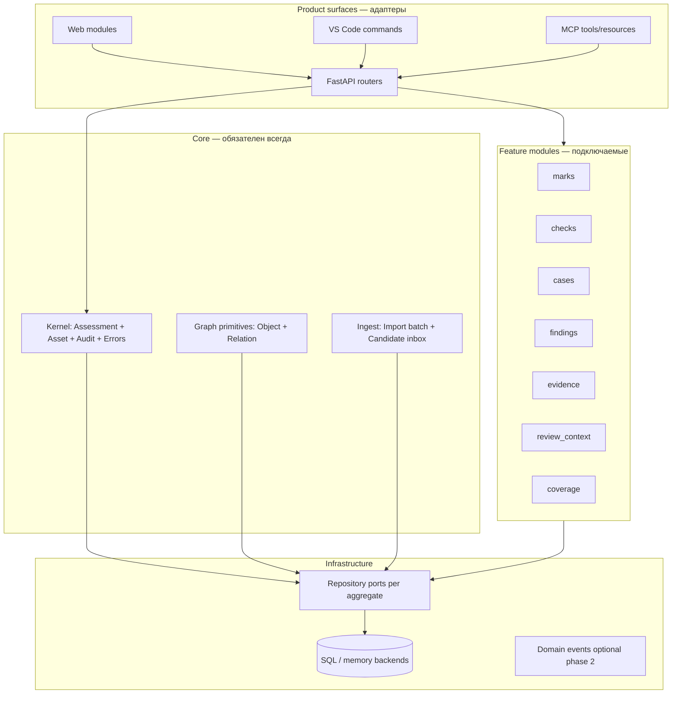
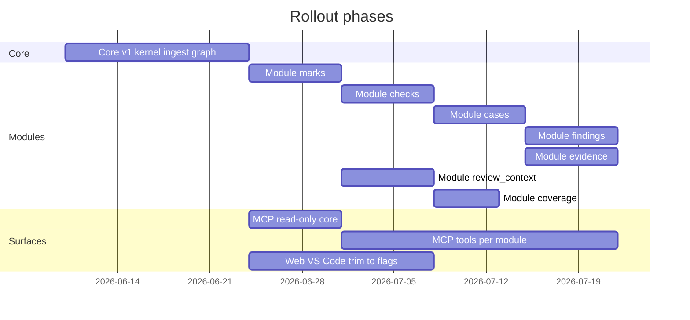
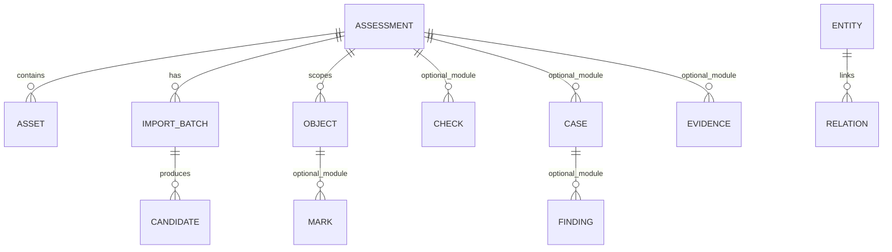

# AppSec Assessment Workbench (AAH2) — Архитектура компонентов

Дата: 2026-06-03  
Цель: зафиксировать верхнеуровневую структуру, **сузить ядро** и описать **инкрементальное** подключение функциональных модулей.

---

## 1. Контекст и принципы

AAH2 — рабочее место аналитика AppSec: импорт сигналов из инструментов, триаж кандидатов, разметка кода (marks), проверки (checks), кейсы и находки, связи и доказательства.

**Целевые принципы рефакторинга:**

| Принцип | Смысл |
|--------|--------|
| Тонкое ядро | Минимум сущностей и контрактов, без бизнес-ветвлений «всё в одном store» |
| Один контракт домена | Pydantic-схемы + сервисы — единственный источник истины; UI/MCP только адаптеры |
| Модульность по вертикалям | Каждый домен — пакет: schema → service → repository → routes |
| Инкремент | Сначала ядро + ingest; остальное — подключаемые модули с feature flags |
| Поверхности отдельно | Backend, Web, VS Code, MCP — клиенты ядра, не дублируют логику |

---

## 2. Текущее состояние (as-is)



**Проблемы as-is:**

- `InMemoryStore` / `SqlStore` — единый «бог-объект» на ~10 доменных агрегатов (assessment, asset, import, candidate, object, mark, check, case, finding, relation, evidence).
- Маршруты вызывают `get_store()` напрямую; слой `services/` почти не выделен (кроме `dedupe`).
- `review_context` и `coverage` — read-model логика внутри routes, завязана на полный store.
- MCP описан в `AGENTS.md`, каталог `app/mcp/` отсутствует.
- Web и extension дублируют все страницы/команды сразу, без поэтапного включения.

---

## 3. Целевая декомпозиция (to-be)

### 3.1. Слои платформы



### 3.2. Определение «ядра» (Core v1)

Ядро должно обеспечивать **контейнер работы** и **приём внешних сигналов**, без аналитических артефактов.

| Компонент | Ответственность | Входит в Core v1 |
|-----------|-----------------|------------------|
| **Assessment** | Сессия оценки, статус, метаданные | да |
| **Asset** | Цели (repo, URL, binary, …) | да |
| **Import + Candidate** | Пакетный импорт, dedupe, accept/reject/merge | да |
| **Object** | Локаторы в коде/артефактах (узел графа) | да |
| **Relation** | Типизированные рёбра между сущностями | да (базовый предикатный граф) |
| **Audit + DomainError** | Наблюдаемость, единый формат ошибок | да |
| **Mark** | SOURCE/SINK/… на object | модуль `marks` |
| **Check** | Чеклист проверок | модуль `checks` |
| **Case** | Контейнер работы аналитика (гипотеза/инцидент) | модуль **`cases`** (зафиксировано, не в ядре) |
| **Finding** | Отчётная уязвимость (severity, impact, …) | модуль **`findings`** |
| **Evidence** | Артефакты доказательств | модуль `evidence` |
| **ReviewContext** | Агрегация по file/line | модуль `review_context` (read-model) |
| **Coverage** | Метрики покрытия оценки | модуль `coverage` (read-model) |

**Граница ядра:** всё, что нужно, чтобы загрузить кандидатов, принять их в `Object` (+ опционально `Relation`), и вести audit. Marks/checks/cases — материализация **после** accept по типу кандидата, но реализация выносится в модули.

### 3.3. Карта пакетов backend (целевая структура)

```
app/
├── core/                    # Kernel
│   ├── assessment/
│   ├── asset/
│   ├── audit.py
│   └── errors.py
├── graph/                   # Object + Relation (shared graph)
│   ├── objects/
│   └── relations/
├── ingest/                  # Import + Candidate + dedupe
│   ├── imports/
│   ├── candidates/
│   └── dedupe.py
├── modules/                 # Feature modules (plug-in)
│   ├── marks/
│   ├── checks/
│   ├── cases/
│   ├── findings/
│   ├── evidence/
│   ├── review_context/
│   └── coverage/
├── infrastructure/
│   ├── repositories/        # Ports + SQL/memory adapters per aggregate
│   └── db/
├── api/
│   ├── core_routes.py       # assessment, asset, audit
│   ├── ingest_routes.py
│   └── module_registry.py   # условное подключение routers
└── mcp/                     # тонкий слой над теми же services
```

### 3.4. Контракт модуля

Каждый feature module экспортирует:

1. **Schemas** — `Create` / `Read` / `Update` (Pydantic).
2. **Service** — бизнес-операции; без прямого доступа к SQL из routes.
3. **Repository port** — интерфейс персистентности (1 агрегат = 1 port).
4. **Router** — HTTP; регистрируется через `module_registry`.
5. **Capability flag** — `AAH2_MODULE_CHECKS=1` и т.д.

`CandidateAcceptHandler` в ingest делегирует в зарегистрированные обработчики по `CandidateType` (registry pattern), вместо монолитного `accept_candidate` в store.

---

## 4. Клиентские поверхности

| Surface | Роль | Стратегия уменьшения |
|---------|------|----------------------|
| **FastAPI** | Канонический API | Core routes всегда; module routes — по flags |
| **Web** | Inbox + обзор | Shell + lazy routes; страницы модулей за feature flags |
| **VS Code** | Code-local UX | Минимум: review-context + create mark; остальное — по мере модулей |
| **MCP** | Agent API | Phase 0: read-only resources ядра + ingest; tools — с модулями |

**Правило паритета** (из `AGENTS.md`): новая операция проходит матрицу Backend → Web → VS Code → MCP, но **только для включённых модулей**.

---

## 5. Инкрементальный план накатывания



### Phase 0 — Core v1 (целевой MVP ядра)

**Включено:** Assessment, Asset, Import/Candidate (inbox), Object, Relation, Audit, health.  
**Выключено из обязательного runtime:** отдельные routers marks/checks/cases/findings/evidence/coverage (можно 501 или feature-off).

**Задачи рефакторинга:**

1. Разбить `InMemoryStore` / `SqlStore` на repository per aggregate.
2. Ввести `CandidateAcceptRegistry` — accept только OBJECT/RELATION в core; MARK/CHECK/CASE — stub до модуля.
3. `module_registry` в `main.py` — регистрация routers по env.
4. Миграции Alembic: core tables стабильны; таблицы модулей — отдельные revision groups.

**Критерий готовности:** docker-compose поднимает backend; ingest → accept OBJECT; audit пишется; web показывает Dashboard + Assets + Imports + Candidates.

### Phase 1 — Marks + Review Context

- Модуль `marks`: create/update mark, привязка к object.
- `review_context` как read-model: зависит от objects, marks, candidates (без cases).
- VS Code: CodeLens mark + panel context.
- MCP: `aah2_create_mark`, resource review-context.

### Phase 2 — Checks

- Модуль `checks`: CRUD статусов, convert_to_finding (hook для phase 3).
- Web: страница Checks за flag.
- MCP: check tools + prompt `aah2_convert_failed_check_to_finding`.

### Phase 3 — Cases & Findings

- Модуль **`cases`**: Case CRUD, accept `CandidateType.CASE`.
- Модуль **`findings`**: Finding, accept `FINDING_DRAFT`, convert check→finding.
- Web: Cases, Findings (страницы за `capabilities.modules`).

### Phase 4 — Evidence & Relations polish

- Модуль `evidence`: attach + auto-relations.
- Ужесточение validation relations (уже частично есть в tests).

### Phase 5 — Coverage + MCP parity

- `coverage` read-model поверх marks/checks/objects.
- Полная матрица MCP prompts/tools из `AGENTS.md`.

### Phase 6 — Hardening

- SQL parity = memory для всех **включённых** модулей.
- Integration/e2e per phase.
- Удаление legacy monolithic store.

---

## 6. Модель данных (упрощённая)



**Ядро графа:** `ASSESSMENT` → `OBJECT` → `RELATION` (между любыми entity types).  
Модули добавляют узлы и предикаты, не меняя kernel ID-пространство.

---

## 7. Feature flags (пример)

```bash
# Core always on
AAH2_MODULES=core

# Incremental
AAH2_MODULES=core,marks,review_context
AAH2_MODULES=core,marks,checks,cases,findings,evidence,coverage
```

Реализация: `app/bootstrap.py` читает список и вызывает `register_module(name)`.

---

## 8. Риски и митигация

| Риск | Митигация |
|------|-----------|
| Долгий split SqlStore | Порты + адаптеры; parity-тесты на каждый aggregate |
| Ломается accept_candidate | Registry + интеграционные тесты по CandidateType |
| Web/Extension drift | Feature flags синхронизированы с backend modules list endpoint `GET /api/capabilities` |
| MCP shadow backend | MCP только вызывает services, как HTTP |

---

## 9. Рекомендуемые следующие задачи (issue breakdown)

1. **CAD-X** — Extract repositories из monolithic store (assessment, asset, candidate, object).
2. **CAD-X** — `module_registry` + `GET /api/capabilities`.
3. **CAD-X** — `CandidateAcceptRegistry` + core-only accept path.
4. **CAD-X** — MCP skeleton (`app/mcp/`, read-only core resources).
5. **CAD-X** — Module `marks` vertical slice (backend + web flag + vscode mark command).

---

## 10. Резюме

| Было | Станет |
|------|--------|
| Один Store на все домены | Core + plug-in modules с repository ports |
| 12 routers всегда активны | Core routers + условные module routers |
| accept_candidate — монолит | Registry handlers per CandidateType |
| MCP отсутствует | MCP как 4-я поверхность над services |
| Все UI-страницы сразу | Web/IDE по `capabilities` / feature flags |

**Ядро v1** = Assessment + Asset + Ingest/Candidate + Object + Relation + Audit.  
**Case** — модуль `cases`, не ядро (решение зафиксировано в CAD-4).  
Всё остальное накатывается **модулями** с явными фазами и тестами parity на границе каждой фазы.

**Издания Standalone / Corporate:** см. `docs/ARCHITECTURE_EDITIONS.md` — edition-профили поверх тех же core + modules, без форка репозитория.

**Миграции БД по модулям:** см. `docs/ARCHITECTURE_MIGRATIONS.md` — core revisions + module revisions, edition-aware `alembic upgrade`.
