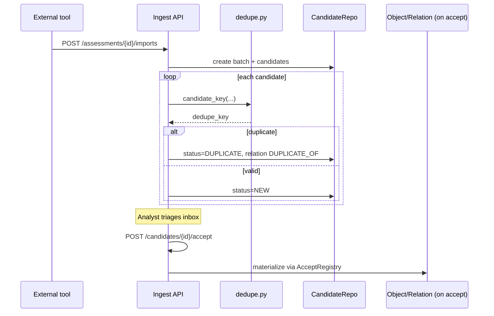

# Ядро v1 и подключение плагинов — детальная спецификация

Дополнение к `ARCHITECTURE.md`. Описывает **что именно входит в runtime ядра**, контракты, API, потоки данных и **механику plug-in модулей** со структурой каталогов и примерами кода.

---

## 1. Что такое «минимум runtime»

**Core v1** — единственный обязательный набор процессов при старте `aah2-api`. Он отвечает на вопросы:

1. *Где* идёт оценка? → `Assessment`
2. *Что* оцениваем? → `Asset`
3. *Какие сигналы* пришли извне и что с ними делать? → `Import` + `Candidate`
4. *Куда* материализуем принятые факты? → `Object` + `Relation`
5. *Кто* и *что* сделал в системе? → `Audit` + `DomainError`

Всё, что требует аналитической семантики (SOURCE/SINK, чеклист, кейс, finding, evidence blob, coverage %) — **не в ядре**, а в плагинах. Ядро знает про типы кандидатов `MARK` / `CHECK` / `CASE`, но **не умеет** их accept без зарегистрированного handler.

---

## 2. Assessment + Asset

### 2.1. Назначение

| Сущность | Роль | Инварианты |
|----------|------|------------|
| **Assessment** | Корневая «сессия» работы аналитика | Все остальные записи имеют `assessment_id`; удаление assessment = каскад (phase 2) или soft-archive |
| **Asset** | Цель в scope оценки (repo, URL, binary, …) | `asset.assessment_id` обязателен; import может ссылаться на `asset_id` |

### 2.2. Контракты (уже в коде, остаются в `app/core/`)

```python
# app/core/assessment/schemas.py  (перенос из app/schemas/assessment.py)
class AssessmentCreate(BaseModel):
    title: str
    description: str = ""

class AssessmentRead(BaseModel):
    id: UUID
    title: str
    status: AssessmentStatus = AssessmentStatus.DRAFT
    ...
```

```python
# app/core/asset/schemas.py
class AssetCreate(BaseModel):
    type: AssetType
    name: str
    locator: str | None = None
    version_ref: str | None = None
    metadata: dict = Field(default_factory=dict)
```

### 2.3. Сервисный слой

```python
# app/core/assessment/service.py
class AssessmentService:
    def __init__(self, repo: AssessmentRepository, audit: AuditPort):
        self._repo = repo
        self._audit = audit

    def create(self, payload: AssessmentCreate) -> AssessmentRead:
        record = self._repo.create(payload)
        self._audit.record("assessment.created", {"assessment_id": str(record.id)})
        return record

    def get(self, assessment_id: UUID) -> AssessmentRead:
        record = self._repo.get(assessment_id)
        if not record:
            raise DomainError("ASSESSMENT_NOT_FOUND", "Assessment not found", status_code=404)
        return record
```

```python
# app/core/asset/service.py
class AssetService:
    def __init__(self, assessments: AssessmentService, repo: AssetRepository, audit: AuditPort):
        ...

    def create(self, assessment_id: UUID, payload: AssetCreate) -> AssetRead:
        self._assessments.get(assessment_id)  # guard
        record = self._repo.create(assessment_id, payload)
        self._audit.record("asset.created", {"asset_id": str(record.id), "assessment_id": str(assessment_id)})
        return record
```

### 2.4. Repository port

```python
# app/infrastructure/repositories/assessment.py
from typing import Protocol

class AssessmentRepository(Protocol):
    def create(self, payload: AssessmentCreate) -> AssessmentRead: ...
    def get(self, assessment_id: UUID) -> AssessmentRead | None: ...
    def list(self) -> list[AssessmentRead]: ...
    def update(self, assessment_id: UUID, payload: AssessmentUpdate) -> AssessmentRead | None: ...
```

Реализации: `MemoryAssessmentRepository`, `SqlAssessmentRepository` — без знания про marks/checks.

### 2.5. HTTP (ядро)

```
POST   /api/assessments
GET    /api/assessments
GET    /api/assessments/{id}
PATCH  /api/assessments/{id}

POST   /api/assessments/{id}/assets
GET    /api/assessments/{id}/assets
GET    /api/assets/{id}
PATCH  /api/assets/{id}
```

### 2.6. Что ядро **не** делает

- Не хранит marks/checks/cases в `AssessmentService`
- Не считает coverage
- Metadata assessment — произвольный JSON, но **без** доменной валидации модулей

---

## 3. Import + Candidate (Ingest)

### 3.1. Назначение

**Import batch** — пакет загрузки из одного источника (Semgrep, Joern, manual JSON).  
**Candidate** — нормализованный «предложенный факт», ещё не принятый в граф.

Жизненный цикл кандидата:

```
NEW → ACCEPTED | REJECTED | DUPLICATE | ERROR | NEEDS_REVIEW
```

### 3.2. Поток ingest



### 3.3. Dedupe (ядро)

```python
# app/ingest/dedupe.py — уже есть логика, остаётся в ingest
def candidate_key(assessment_id: str, candidate_type: str, payload: dict) -> str:
    canonical = json.dumps(payload, sort_keys=True, default=str)
    return hashlib.sha256(f"{assessment_id}:{candidate_type}:{canonical}".encode()).hexdigest()
```

При duplicate ядро создаёт relation:

```python
RelationCreate(
    subject_type="CANDIDATE", subject_id=new.id,
    predicate="DUPLICATE_OF",
    object_type="CANDIDATE", object_id=existing.id,
    status="ACCEPTED",
)
```

### 3.4. CandidateService

```python
# app/ingest/candidates/service.py
class CandidateService:
    def __init__(
        self,
        repo: CandidateRepository,
        import_repo: ImportRepository,
        accept_registry: CandidateAcceptRegistry,
        relation_service: RelationService,
        audit: AuditPort,
    ):
        ...

    def accept(self, candidate_id: UUID, payload: CandidateAcceptRequest) -> AcceptResult:
        candidate = self._repo.get(candidate_id)
        if not candidate:
            raise DomainError("CANDIDATE_NOT_FOUND", ..., status_code=404)
        if candidate.status == CandidateStatus.ACCEPTED:
            return AcceptResult.empty()

        handler = self._accept_registry.get(candidate.candidate_type)
        if handler is None:
            raise DomainError(
                "MODULE_REQUIRED",
                f"No handler for {candidate.candidate_type}. Enable module or reject candidate.",
                details={"candidate_type": candidate.candidate_type},
                status_code=501,
            )

        created = handler.accept(candidate, payload)
        self._repo.mark_accepted(candidate_id)
        self._audit.record("candidate.accepted", {"candidate_id": str(candidate_id), "created": created.ids_summary()})
        return created
```

### 3.5. AcceptResult (единый ответ)

```python
# app/ingest/candidates/accept_result.py
class AcceptResult(BaseModel):
    object_ids: list[UUID] = []
    mark_ids: list[UUID] = []
    relation_ids: list[UUID] = []
    check_ids: list[UUID] = []
    case_ids: list[UUID] = []

    @classmethod
    def empty(cls) -> "AcceptResult":
        return cls()

    def ids_summary(self) -> dict:
        return self.model_dump()
```

Поля `mark_ids`, `check_ids`, … заполняются **только** если соответствующий модуль включён и handler их создал.

### 3.6. HTTP ingest (ядро)

```
POST   /api/assessments/{id}/imports
GET    /api/assessments/{id}/imports
GET    /api/imports/{id}

GET    /api/assessments/{id}/candidates
GET    /api/candidates/{id}
POST   /api/candidates/{id}/accept
POST   /api/candidates/{id}/reject
POST   /api/candidates/{id}/merge
POST   /api/candidates/batch-accept   # опционально phase 1
```

### 3.7. Core-only accept handlers (в ядре)

```python
# app/ingest/candidates/handlers/object_handler.py
class ObjectCandidateHandler:
    candidate_type = CandidateType.OBJECT

    def __init__(self, objects: ObjectService):
        self._objects = objects

    def accept(self, candidate: CandidateRead, payload: CandidateAcceptRequest) -> AcceptResult:
        p = payload.override_payload or candidate.proposed_payload
        obj = self._objects.create(candidate.assessment_id, ObjectCreate(
            asset_id=p.get("asset_id"),
            type=p.get("type", "UNKNOWN"),
            kind=p.get("kind", "UNKNOWN"),
            name=p.get("name", "Unnamed object"),
            locator=p.get("locator"),
            range=p.get("range"),
            properties=p.get("properties", {}),
            source=candidate.source,
        ))
        return AcceptResult(object_ids=[obj.id])


# app/ingest/candidates/handlers/relation_handler.py
class RelationCandidateHandler:
    candidate_type = CandidateType.RELATION

    def __init__(self, relations: RelationService):
        self._relations = relations

    def accept(self, candidate, payload) -> AcceptResult:
        p = payload.override_payload or candidate.proposed_payload
        rel = self._relations.create(candidate.assessment_id, RelationCreate(**p))
        return AcceptResult(relation_ids=[rel.id])
```

---

## 4. Object + Relation (граф ядра)

### 4.1. Object — узел локатора

**Object** — привязка к asset: файл+строки, symbol, endpoint, и т.д. Это универсальный узел, на который позже навешивают marks (модуль), evidence links и т.д.

```python
# app/graph/objects/schemas.py
class ObjectCreate(BaseModel):
    asset_id: UUID | None = None
    type: str = "UNKNOWN"      # CALLSITE, ENDPOINT, ...
    kind: str = "UNKNOWN"
    name: str
    locator: str | None = None
    range: dict | None = None   # {start_line, end_line, ...}
    properties: dict = Field(default_factory=dict)
    source: SourceType = SourceType.OTHER
```

### 4.2. Relation — типизированное ребро

```python
# app/graph/relations/schemas.py
class RelationCreate(BaseModel):
    subject_type: str   # CANDIDATE | OBJECT | MARK | CHECK | ...
    subject_id: UUID
    predicate: str      # DUPLICATE_OF | REFERENCES | FLOWS_TO | ...
    object_type: str
    object_id: UUID
    status: str = "PROPOSED"
    source: SourceType = SourceType.OTHER
    properties: dict = Field(default_factory=dict)
```

Ядро валидирует **структуру** (оба ID существуют в scope assessment, predicate из allowlist ядра). Модули регистрируют **расширения allowlist** (см. §6).

### 4.3. ObjectService / RelationService

```python
class ObjectService:
    def create(self, assessment_id: UUID, payload: ObjectCreate) -> ObjectRead:
        self._guard_assessment(assessment_id)
        if payload.asset_id:
            self._assets.get(payload.asset_id)  # guard asset in same assessment
        return self._repo.create(assessment_id, payload)

class RelationService:
    def create(self, assessment_id: UUID, payload: RelationCreate) -> RelationRead:
        self._validate_endpoints(assessment_id, payload)  # core + module predicates
        return self._repo.create(assessment_id, payload)
```

### 4.4. HTTP graph (ядро)

```
POST   /api/assessments/{id}/objects
GET    /api/assessments/{id}/objects
GET    /api/objects/{id}

POST   /api/assessments/{id}/relations
GET    /api/assessments/{id}/relations
GET    /api/relations/{id}
```

---

## 5. Audit + DomainError

### 5.1. DomainError (сквозной)

Уже есть `app/api/errors.py`. В ядре — единственный handler на FastAPI:

```python
# app/core/errors.py — реэкспорт
class DomainError(Exception):
    error: str      # machine code: MODULE_REQUIRED, VALIDATION_FAILED, ...
    message: str
    details: dict
    status_code: int
```

**Правило:** routes не возвращают произвольные `HTTPException` для доменных случаев — только `DomainError` или 404 на missing id.

### 5.2. AuditPort

```python
# app/core/audit/port.py
class AuditPort(Protocol):
    def record(self, event: str, payload: dict) -> None: ...

# app/core/audit/memory.py — для dev
class InMemoryAudit(AuditPort):
    def __init__(self):
        self.events: list[dict] = []

    def record(self, event: str, payload: dict) -> None:
        self.events.append({"event": event, "payload": payload, "at": utcnow().isoformat()})
```

События ядра (минимум):

| event | когда |
|-------|--------|
| `assessment.created` | create assessment |
| `asset.created` | create asset |
| `import.created` | batch import |
| `candidate.accepted` | accept |
| `candidate.rejected` | reject |
| `candidate.merged` | merge |

Модули добавляют свои: `mark.created`, `check.status_updated`, … через тот же `AuditPort` (inject).

### 5.3. HTTP

```
GET /api/audit-events          # dev/read-only
GET /api/capabilities          # список включённых модулей (см. §6)
GET /health
```

---

## 6. Подключение плагинов — механика

### 6.1. Структура каталогов (целевая)

```
app/
├── bootstrap.py                 # сборка AppContext, загрузка модулей
├── context.py                   # AppContext — DI-контейнер
├── core/
│   ├── assessment/
│   ├── asset/
│   ├── audit/
│   └── errors.py
├── graph/
│   ├── objects/
│   └── relations/
├── ingest/
│   ├── imports/
│   ├── candidates/
│   │   ├── service.py
│   │   ├── registry.py
│   │   └── handlers/          # object, relation — core handlers
│   └── dedupe.py
├── modules/
│   ├── base.py                  # Aah2Module Protocol
│   ├── marks/
│   │   ├── __init__.py          # class MarksModule(Aah2Module)
│   │   ├── schemas.py
│   │   ├── service.py
│   │   ├── repository.py
│   │   ├── routes.py
│   │   └── candidate_handler.py
│   ├── checks/
│   ├── cases/
│   ├── findings/
│   └── ...
├── infrastructure/
│   └── repositories/
└── api/
    └── routes/                  # тонкие обёртки → services
```

### 6.2. Контракт плагина `Aah2Module`

```python
# app/modules/base.py
from typing import Protocol
from fastapi import APIRouter

class Aah2Module(Protocol):
    name: str                           # "marks"
    version: str                        # "1.0.0"

    def register(self, ctx: "AppContext") -> None:
        """Подключить handlers, routes, predicate extensions."""
        ...

    def routers(self) -> list[APIRouter]:
        """HTTP endpoints модуля."""
        ...

    def candidate_handlers(self) -> list["CandidateAcceptHandler"]:
        """Обработчики accept по CandidateType."""
        ...

    def capabilities(self) -> dict:
        """Что отдаём в GET /api/capabilities."""
        ...
```

### 6.3. AppContext — DI на старте

```python
# app/context.py
@dataclass
class AppContext:
    assessments: AssessmentService
    assets: AssetService
    imports: ImportService
    candidates: CandidateService
    objects: ObjectService
    relations: RelationService
    audit: AuditPort
    accept_registry: CandidateAcceptRegistry
    enabled_modules: set[str]
```

```python
# app/bootstrap.py
import os
from app.context import AppContext
from app.modules.base import Aah2Module

MODULE_LOADERS: dict[str, type[Aah2Module]] = {
    "marks": MarksModule,
    "checks": ChecksModule,
    "cases": CasesModule,
    "findings": FindingsModule,
    "evidence": EvidenceModule,
    "review_context": ReviewContextModule,
    "coverage": CoverageModule,
}

def build_context() -> AppContext:
    backend = os.getenv("STORE_BACKEND", "memory")
    repos = create_repositories(backend)

    audit = InMemoryAudit()
    assessments = AssessmentService(repos.assessments, audit)
    assets = AssetService(assessments, repos.assets, audit)
    objects = ObjectService(assessments, assets, repos.objects)
    relations = RelationService(assessments, repos.relations)

    accept_registry = CandidateAcceptRegistry()
    accept_registry.register(ObjectCandidateHandler(objects))
    accept_registry.register(RelationCandidateHandler(relations))

    ctx = AppContext(
        assessments=assessments,
        assets=assets,
        imports=ImportService(...),
        candidates=None,  # set below
        objects=objects,
        relations=relations,
        audit=audit,
        accept_registry=accept_registry,
        enabled_modules={"core"},
    )

    candidates = CandidateService(repos.candidates, repos.imports, accept_registry, relations, audit)
    ctx.candidates = candidates

    # --- plug-ins ---
    enabled = set(os.getenv("AAH2_MODULES", "core").split(","))
    for name in enabled:
        if name == "core":
            continue
        loader = MODULE_LOADERS.get(name)
        if not loader:
            raise RuntimeError(f"Unknown module: {name}")
        mod = loader()
        mod.register(ctx)
        ctx.enabled_modules.add(name)

    return ctx
```

### 6.4. CandidateAcceptRegistry

```python
# app/ingest/candidates/registry.py
class CandidateAcceptHandler(Protocol):
    candidate_type: CandidateType
    def accept(self, candidate: CandidateRead, payload: CandidateAcceptRequest) -> AcceptResult: ...

class CandidateAcceptRegistry:
    def __init__(self):
        self._handlers: dict[CandidateType, CandidateAcceptHandler] = {}

    def register(self, handler: CandidateAcceptHandler) -> None:
        self._handlers[handler.candidate_type] = handler

    def get(self, t: CandidateType) -> CandidateAcceptHandler | None:
        return self._handlers.get(t)
```

### 6.5. Пример плагина `marks`

```python
# app/modules/marks/__init__.py
class MarksModule:
    name = "marks"
    version = "1.0.0"

    def __init__(self):
        self._router = APIRouter(tags=["marks"])
        self._service: MarkService | None = None

    def register(self, ctx: AppContext) -> None:
        repo = ctx.repos.marks  # или factory
        self._service = MarkService(ctx.objects, repo, ctx.audit)
        ctx.accept_registry.register(MarkCandidateHandler(self._service, ctx.objects))
        self._wire_routes()

    def routers(self) -> list[APIRouter]:
        return [self._router]

    def candidate_handlers(self) -> list:
        return [MarkCandidateHandler(self._service, ...)]

    def capabilities(self) -> dict:
        return {"marks": {"create": True, "update": True}}

    def _wire_routes(self):
        @self._router.post("/api/assessments/{assessment_id}/marks")
        def create_mark(assessment_id: UUID, payload: MarkCreate):
            return self._service.create(assessment_id, payload)
```

```python
# app/modules/marks/candidate_handler.py
class MarkCandidateHandler:
    candidate_type = CandidateType.MARK

    def __init__(self, marks: MarkService, objects: ObjectService):
        self._marks = marks
        self._objects = objects

    def accept(self, candidate: CandidateRead, payload: CandidateAcceptRequest) -> AcceptResult:
        p = payload.override_payload or candidate.proposed_payload
        obj_payload = p.get("object", {})
        obj = self._objects.create(candidate.assessment_id, ObjectCreate(...))
        mark = self._marks.create(candidate.assessment_id, MarkCreate(object_id=obj.id, ...))
        return AcceptResult(object_ids=[obj.id], mark_ids=[mark.id])
```

### 6.6. main.py — регистрация routers

```python
# app/main.py
from app.bootstrap import build_context

ctx = build_context()
app = FastAPI(title="AAH2", version="0.4.0")
app.add_exception_handler(DomainError, domain_error_handler)

# Core routes (всегда)
app.include_router(core_assessment_router(ctx))
app.include_router(core_ingest_router(ctx))
app.include_router(core_graph_router(ctx))

# Module routes
for module_name in ctx.enabled_modules:
    if module_name == "core":
        continue
    mod = MODULE_LOADERS[module_name]()  # или кэш из ctx
    for r in mod.routers():
        app.include_router(r)

@app.get("/api/capabilities")
def capabilities():
    caps = {"core": ["assessment", "asset", "import", "candidate", "object", "relation", "audit"]}
    for name in ctx.enabled_modules:
        if name != "core":
            caps[name] = MODULE_INSTANCES[name].capabilities()
    return {"modules": sorted(ctx.enabled_modules), "capabilities": caps}
```

### 6.7. Поведение при выключенном модуле

| Действие | Результат |
|----------|-----------|
| `POST /marks` без модуля `marks` | route не зарегистрирован → **404** |
| `accept` кандидата `MARK` без модуля | **501** `MODULE_REQUIRED` |
| Web запрашивает `/api/capabilities` | marks отсутствует → UI скрывает страницу |
| Import с кандидатами MARK | batch создаётся; accept откладывается до включения модуля |

### 6.8. Read-model плагины (`review_context`, `coverage`)

Не добавляют candidate handlers; подписываются на **read ports**:

```python
class ReviewContextModule:
    name = "review_context"

    def register(self, ctx: AppContext) -> None:
        self._service = ReviewContextService(
            objects=ctx.objects,
            marks=ctx.modules.get("marks"),  # optional dependency
            candidates=ctx.candidates,
        )
```

Если `marks` выключен — review context возвращает только objects + candidates (деградация, не ошибка).

### 6.9. Зависимости между модулями

```python
# app/modules/base.py
MODULE_DEPENDS: dict[str, list[str]] = {
    "review_context": [],           # soft-depends on marks
    "coverage": ["marks"],          # hard-depends — bootstrap проверяет
    "findings": ["cases"],          # soft: finding без case редко
    "coverage": ["cases"],          # soft
    "review_context": ["cases"],    # soft
}

def validate_module_set(enabled: set[str]) -> None:
    for mod in enabled:
        for dep in MODULE_DEPENDS.get(mod, []):
            if dep not in enabled:
                raise RuntimeError(f"Module {mod} requires {dep}")
```

### 6.10. Клиенты (Web / VS Code / MCP)

```typescript
// web/src/api/capabilities.ts
export async function loadCapabilities() {
  const res = await fetch(`${API}/capabilities`);
  return res.json() as { modules: string[]; capabilities: Record<string, unknown> };
}

// web/src/app/router.tsx — условные маршруты
{capabilities.modules.includes("marks") && (
  <Route path="objects" element={<ObjectsPage />} />
)}
```

```python
# app/mcp/server.py — tools регистрируются из включённых модулей
def build_mcp(ctx: AppContext):
    server = Server("aah2")
    register_core_resources(server, ctx)
    if "marks" in ctx.enabled_modules:
        register_mark_tools(server, ctx.marks)
    return server
```

---

## 7. Cases — зафиксированное решение (CAD-4)

> **Case — только плагин `cases`. В ядро не входит.** Finding — отдельный плагин `findings`.

| Что | Где |
|-----|-----|
| `CaseService`, routes `/cases`, `CaseCandidateHandler` | `app/modules/cases/` |
| `FindingService`, routes `/findings`, `FINDING_DRAFT` handler | `app/modules/findings/` |
| Тип `CASE` в relation allowlist | **ядро** (`graph/relations`) — endpoint графа, без CRUD |
| `CandidateType.CASE` accept | модуль `cases` (без модуля → `501 MODULE_REQUIRED`) |
| `review_context`, `coverage` | `depends: [cases]` (optional degradation) |

**Edition baseline:** standalone и corporate включают `cases` в analyst modules (не в `core`).

```bash
# strict ingest
AAH2_MODULES=core

# analyst workbench (типичный standalone)
AAH2_MODULES=core,marks,checks,cases,findings,review_context,coverage
```

```python
# app/modules/cases/__init__.py
class CasesModule(Aah2Module):
    name = "cases"

    def register(self, ctx: AppContext) -> None:
        self._service = CaseService(ctx.repos.cases, ctx.audit)
        ctx.accept_registry.register(CaseCandidateHandler(self._service))
        # routes POST/GET /api/assessments/{id}/cases
```

Ниже — историческое обсуждение за/против (§7.1–7.4); актуальная позиция — **плагин**, не workflow-core.

### Почему Case вынесен из ядра

| Критерий ядра v1 | Case |
|------------------|------|
| Нужен для ingest→materialize? | Нет — инструменты шлют OBJECT/MARK/CHECK кандидатов, не «кейсы» |
| Минимальный deploy (только приём сигналов) | Case не обязателен |
| Толстая доменная семантика | Да — status, severity_hint, связи PART_OF с marks/checks, coverage |

**Finding** однозначно вне ядра — это отчётный артефакт (severity, impact, recommendation).

### Почему аргумент «Cases в ядре» справедлив

В AAH2 Case — **единица организации работы** аналитика (гипотеза / инцидент), а не побочный отчёт:

- `review_context` предлагает `CREATE_CASE_FROM_MARK`
- `relations` валидирует `MARK/CHECK PART_OF CASE`, `FINDING GENERATED_FROM …`
- `coverage` считает «open cases without checks»

То есть граф ядра уже **знает** тип `CASE` как endpoint relation, даже если CRUD Case — в модуле. Это разрыв: relation allowlist есть, сущности может не быть без плагина.

### Разделение модулей (зафиксировано)

```
┌──────────────────────────────────────────┐
│  Core v1                                 │
│  Assessment, Asset, Ingest, Object,      │
│  Relation, Audit (+ CASE в allowlist)   │
└──────────────────────────────────────────┘
                    │
        ┌───────────┼───────────┐
        ▼           ▼           ▼
   module:marks  module:cases  module:findings
   module:checks  ...
```

| Уровень | Что входит | Env |
|---------|------------|-----|
| **Core v1** | Без Case CRUD | `AAH2_MODULES=core` |
| **+ cases** | Case CRUD, accept CASE | `...,cases` |
| **+ findings** | Finding, FINDING_DRAFT, convert | `...,findings` |

### Accept handler — в модуле `cases`

```python
# app/modules/cases/candidate_handler.py
class CaseCandidateHandler:
    candidate_type = CandidateType.CASE

    def accept(self, candidate, payload) -> AcceptResult:
        case = self._cases.create(candidate.assessment_id, CaseCreate(**p))
        return AcceptResult(case_ids=[case.id])
```

### За и против Case в ядре (развёрнуто)

См. полную таблицу критериев в §7.1–7.3 ниже.

#### §7.1 За Case в ядре

| # | Аргумент | Детали |
|---|----------|--------|
| Z1 | **Продуктовая центральность** | Case = «папка» работы аналитика; без неё UI — набор разрозненных objects/marks, а не оценка |
| Z2 | **Связность графа** | `relations.py` уже валидирует `PART_OF → CASE`; endpoint `CASE` в `_ALLOWED` — ядро «ожидает» сущность |
| Z3 | **Review / coverage** | `review_context` → `CREATE_CASE_FROM_MARK`; coverage → `open_without_checks` по cases — read-models ломаются без Case |
| Z4 | **Простота деплоя** | `AAH2_MODULES=core` даёт рабочее место, а не только ingest-pipeline |
| Z5 | **Тонкий домен** | Case schema легковесна (title, status, severity_hint) — не раздувает ядро как Finding |
| Z6 | **Accept CASE** | `CandidateType.CASE` в enum; логично принимать в core, не 501 |
| Z7 | **Порядок rollout** | Marks/checks — плагины, но Case может быть пустым контейнером до их подключения |
| Z8 | **Меньше «висящих» relations** | Relation на несуществующий case_id → ошибки при выключенном модуле |

#### §7.2 Против Case в ядре

| # | Аргумент | Детали |
|---|----------|--------|
| P1 | **Цель «тонкого ядра»** | Каждая сущность в core = обязательный runtime-cost, миграции, тесты, SQL parity |
| P2 | **Ingest не нуждается** | Пайплайн import→candidate→object не использует Case |
| P3 | **Headless / CI** | Автоматический приём Semgrep без аналитика — Case лишний |
| P4 | **Связь с плагинами** | Case без marks/checks/findings — «пустые» кейсы; ценность после модулей |
| P5 | **Дублирование границы** | Тип `CASE` в relation allowlist ≠ обязанность CRUD в core (можно stub) |
| P6 | **coupling** | Core зависит от семантики workflow, сложнее «чистый» graph+ingest |
| P7 | **Эволюция схемы** | Поля case (assignee, SLA, templates) потянут ядро в ticket-system |
| P8 | **Параллель с Finding** | Риск «раз Case в core — и Finding туда же» |

#### §7.3 Матрица решений

| Сценарий | Рекомендация |
|----------|--------------|
| MVP = приём сигналов + materialize objects | Case **вне** ядра (strict core) |
| MVP = аналитик ведёт оценку в UI | модуль **`cases`** в edition baseline |
| Нужны relations PART_OF с первого дня | модуль **`cases`** включён |
| Только API/automation, без UI cases | Case **вне** ядра |
| Планируется SaaS multi-tenant с разными модулями | Case опционален через flag, default on |

#### §7.4 Компромиссы (архив — не применяются)

Ранее обсуждались workflow-core и `AAH2_CORE_CASE`; **отклонено** — Case только в `modules/cases`.

---

## 8. Сводная таблица: ядро vs плагин

| Операция | Слой | Модуль |
|----------|------|--------|
| Создать assessment | core | — |
| Привязать asset | core | — |
| Import batch | ingest (core) | — |
| Accept OBJECT | ingest handler | core |
| Accept RELATION | ingest handler | core |
| Accept MARK | ingest → registry | **marks** |
| Accept CHECK | ingest → registry | **checks** |
| **Создать Case / accept CASE** | plugin | **`cases`** |
| Accept FINDING_DRAFT | ingest → registry | **findings** |
| POST /findings | routes | **findings** |
| POST /marks | routes | **marks** |
| Review by line | read-model | **review_context** |
| Coverage % | read-model | **coverage** |

---

## 8. Миграция с текущего monolith (практический порядок)

1. Ввести `AppContext` + `bootstrap.py`, пока внутри — старый `get_store()`.
2. Вынести `AssessmentService` / `AssetService`, routes тонкие.
3. Добавить `CandidateAcceptRegistry`; перенести OBJECT/MARK/CHECK ветки из `InMemoryStore.accept_candidate` в handlers.
4. MARK/CHECK ветки — в `MarksModule` / `ChecksModule`; store method deprecate.
5. Разрезать store на repos; feature flag `AAH2_MODULES`.
6. `GET /api/capabilities` + web conditional routes.

---

## 9. Минимальный docker-compose для Core v1

```yaml
environment:
  AAH2_MODULES: core
  STORE_BACKEND: sql
```

Проверка: import JSON → inbox → accept OBJECT → object появился в `GET /objects` → запись в audit.
