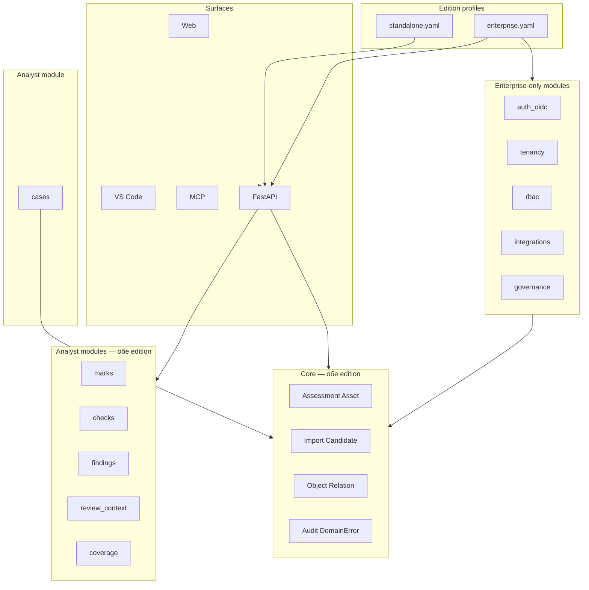

# AAH2 — издания: Standalone и Corporate (Enterprise)

Как две продуктовые линии ложатся на архитектуру **ядро + плагины**, без форка кодовой базы.

---

## 1. Принцип: одна кодовая база, два edition-профиля

| Не делаем | Делаем |
|-----------|--------|
| Два репозитория / долгоживущие git-ветки `standalone` vs `corporate` | Один `main`, **edition manifest** + разные compose/helm values |
| Дублирование domain logic | Общие `core` + `graph` + `ingest` + analyst modules |
| Разные схемы API | Один API; расширения corporate — **enterprise-модули** и поля |

```bash
AAH2_EDITION=standalone   # default для docker-compose локально
AAH2_EDITION=enterprise  # корпоративный стенд
AAH2_MODULES=...         # поверх edition baseline
```

---

## 2. Слои архитектуры с edition



---

## 3. Standalone edition

### 3.1. Целевая аудитория

- Один аналитик или малая команда (2–5 человек)
- Локальный запуск: `docker compose up`
- Self-hosted, один tenant (неявный)
- VS Code + Web + MCP на одной машине

### 3.2. Baseline модулей

```yaml
# app/editions/standalone.yaml
edition: standalone
core:
  # Case НЕ в core (CAD-4)
modules:
  - marks
  - checks
  - cases              # Case CRUD + accept CASE
  - findings
  - review_context
  - coverage
enterprise_modules: []         # пусто
auth:
  mode: optional_api_key       # или none для dev
store:
  default: memory              # или sqlite для персистентности
surfaces:
  web: full_analyst_nav
  vscode: full
  mcp: stdio + optional http
```

### 3.3. Что сознательно **нет** в standalone

- Org/tenant isolation, SSO
- RBAC (роли на assessment)
- Централизованный admin portal
- Интеграции JIRA/ServiceNow/SIEM (можно позже как optional plugin pack)
- Federated audit export (только `GET /audit-events` локально)

### 3.4. Deploy

```yaml
# docker-compose.standalone.yml
services:
  backend:
    environment:
      AAH2_EDITION: standalone
      AAH2_MODULES: core,marks,checks,cases,findings,review_context,coverage
      STORE_BACKEND: memory
  web:
    environment:
      VITE_AAH2_EDITION: standalone
```

### 3.5. Связь с «тонким ядром»

Standalone baseline включает модуль **`cases`** (не core): полный analyst MVP через edition manifest, strict `AAH2_MODULES=core` — без Case.

---

## 4. Corporate (Enterprise) edition

### 4.1. Целевая аудитория

- AppSec / SOC команда в организации
- Центральный инстанс, много пользователей и оценок
- SSO, политики, аудит для compliance
- Интеграция с корпоративным IT (тикеты, SIEM, identity)

### 4.2. Baseline модулей

```yaml
# app/editions/enterprise.yaml
edition: enterprise
core:
  # Case в modules/cases, не в core
modules:
  - marks
  - checks
  - cases
  - findings
  - review_context
  - coverage
enterprise_modules:
  - auth_oidc          # SAML/OIDC/LDAP adapter
  - tenancy            # org_id, workspace isolation
  - rbac               # роли: viewer, analyst, lead, admin
  - integrations       # JIRA, webhook export, SIEM
  - governance         # policy: обязательные checks, шаблоны case
  - audit_export       # syslog / S3 / SIEM sink
auth:
  mode: required_oidc
store:
  default: sql
  required: true
surfaces:
  web: full + admin
  vscode: full + org-scoped API tokens
  mcp: http behind gateway
```

### 4.3. Enterprise-модули (не в ядре)

| Модуль | Ответственность | Зависимости |
|--------|-----------------|-------------|
| **tenancy** | `org_id` на assessment; scope всех queries | core |
| **auth_oidc** | JWT validation, service accounts | tenancy |
| **rbac** | Permission checks в middleware | auth_oidc, tenancy |
| **integrations** | Push finding/case во внешние системы | findings, rbac |
| **governance** | Policy engine (шаблоны, mandatory fields) | cases, checks |
| **audit_export** | Стрим audit events наружу | core audit |

Домен **не дублируется**: enterprise-модули **оборачивают** те же services (decorator / middleware), что и standalone.

### 4.4. Топологии deploy (enterprise)

**Вариант A — monolith (как standalone, но prod):**

```
[IdP] → [Ingress + OIDC] → [AAH2 API + all modules] → [PostgreSQL]
```

**Вариант B — split roles (корпоративный масштаб):**

```
[Ingest workers]  AAH2_MODULES=core,ingest-only  STORE_BACKEND=sql
[App nodes]       AAH2_EDITION=enterprise + full analyst + ent modules
[Web]             VITE_AAH2_EDITION=enterprise
```

Ingest-worker — **strict core** (`AAH2_MODULES=core`): import → object, без модуля `cases`. App nodes — core + analyst modules включая **`cases`**. Edition manifest задаёт профиль per deployment role.

### 4.5. Данные: расширение core без ломки API

```python
# enterprise/tenancy/schemas.py — расширение, не замена
class AssessmentRead(BaseModel):
    id: UUID
    title: str
    org_id: UUID | None = None   # None в standalone
    ...
```

Standalone: `org_id` всегда `None`, middleware tenancy — no-op.  
Enterprise: middleware inject/filter `org_id` из JWT.

---

## 5. Как edition стыкуется с plugin system

### 5.1. Bootstrap

```python
# app/bootstrap.py
def load_edition() -> EditionProfile:
    name = os.getenv("AAH2_EDITION", "standalone")
    return EditionProfile.load(f"app/editions/{name}.yaml")

def build_context() -> AppContext:
    edition = load_edition()
    ctx = build_core(edition.core)
    for mod in edition.modules:
        register_analyst_module(mod, ctx)
    if edition.name == "enterprise":
        for mod in edition.enterprise_modules:
            register_enterprise_module(mod, ctx)
    apply_auth_middleware(edition.auth, ctx)
    return ctx
```

### 5.2. Capabilities endpoint

```json
GET /api/capabilities
{
  "edition": "enterprise",
  "modules": ["core", "marks", "checks", "findings", "auth_oidc", "tenancy", "rbac"],
  "features": {
    "sso": true,
    "multi_tenant": true,
    "admin_ui": true,
    "cases_module": true
  }
}
```

Web читает `edition` + `features` — скрывает admin nav в standalone, показывает org switcher в enterprise.

### 5.3. Модуль `cases` × edition (Case не в core)

| Edition / роль | Модуль `cases` | Обоснование |
|----------------|----------------|-------------|
| Standalone baseline | включён | analyst workbench из коробки |
| Enterprise app node | включён | тот же analyst stack |
| Enterprise ingest worker | **выключен** | `AAH2_MODULES=core` only |

`AAH2_CORE_CASE` **не используется** — Case только через `modules/cases`.

---

## 6. Git-стратегия (что имелось в виду под «две ветки»)

| Подход | Рекомендация |
|--------|--------------|
| Вечные ветки `standalone` / `corporate` | **Не рекомендуется** — drift, двойные merge |
| **Edition manifests** в `main` | **Да** |
| Release channels `standalone-1.x` / `enterprise-1.x` | Теги/образы Docker с разными `AAH2_EDITION` |
| Feature flags per customer | Enterprise: `AAH2_MODULES` + license key (phase 2) |

```dockerfile
# один образ
ARG AAH2_EDITION=standalone
ENV AAH2_EDITION=${AAH2_EDITION}
```

---

## 7. Матрица: компонент × edition

| Компонент | Standalone | Corporate |
|-----------|------------|-----------|
| Core ingest + graph | да | да (+ ingest workers) |
| Module `cases` | да (baseline) | да (app nodes); нет на ingest worker |
| Marks/Checks/Findings | да | да |
| Auth | optional / dev | OIDC required |
| Multi-tenant | нет | tenancy module |
| RBAC | нет | rbac module |
| Integrations | нет / позже | integrations module |
| Audit | in-memory list | + audit_export |
| VS Code | local | + org token |
| MCP | stdio | http + gateway |
| Admin UI | нет | да |

---

## 8. Roadmap внедрения edition

1. **Phase 0** — `EditionProfile` + `AAH2_EDITION` в bootstrap; `GET /capabilities` отдаёт edition.
2. **Phase 1** — `docker-compose.standalone.yml` vs `docker-compose.enterprise.yml` (тот же образ).
3. **Phase 2** — модули `tenancy` + `auth_oidc` (enterprise-only registration).
4. **Phase 3** — `rbac`, `integrations`, ingest worker profile.
5. **Phase 4** — license / module gating (опционально).

---

## 9. Резюме

- **Standalone** = core + analyst modules (включая **`cases`**, **`findings`**), простой auth, single-tenant.
- **Corporate** = то же + enterprise modules; ingest workers без `cases`.
- **Case в ядре — нет** (CAD-4): только `app/modules/cases/`.
